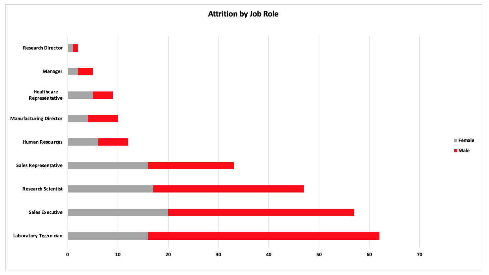
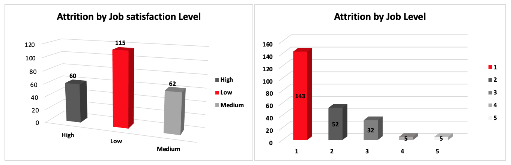
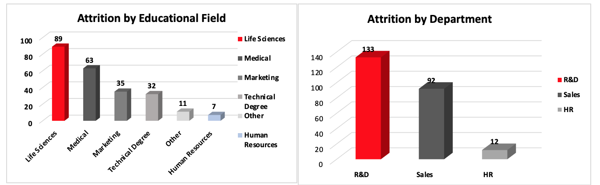
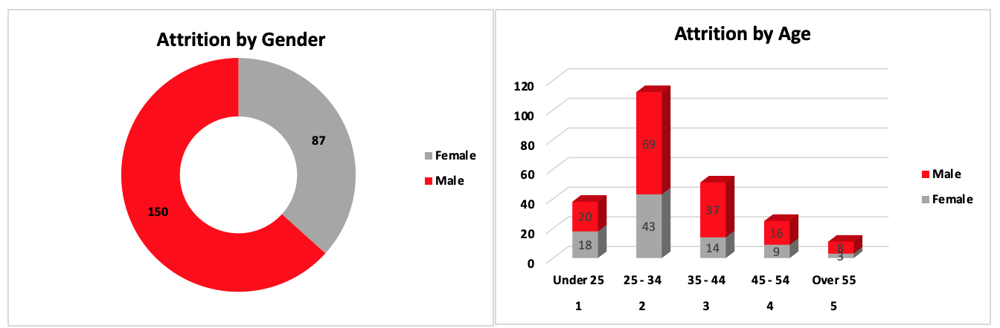
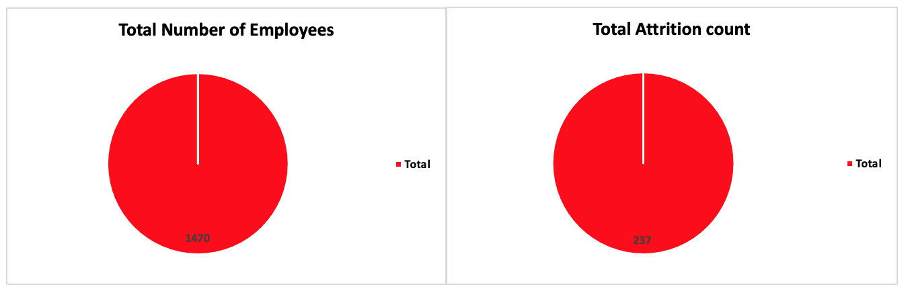

# HR_Data
## Project Title: Kikelomo Stores Sales Analysis


### Introduction
This is a Microsoft Excel project on attrition analysis of an imaginary organization called **Premium Shirtees**. 
The project is aimed at analysing and deriving insights to answer critical questions and help the orgnization make data driven decusions.
**_Disclaimer_**: _All datasets and reports do not represent any company, institution or country but a dummy dataset to demonstrate the cabability of Microsoft  Excel._

### Problem Statement
- How many employees left the company?
- What was the impact of attrition on each department’s performance?
- What is the gender breakdown of employees who left?
- How is employee satisfaction related to attrition rates?
- Is there a link between age and attrition?
- Does education level correlate with attrition rates?
- Which job roles were most affected by attrition?
- Any other relevant insights.

### Excel Concept applied
- Excel functions; IF, IFS, TRIM, X-LOOKUP
```excel
=IFS(D2= "Under 25", 1,D2= "25 - 34", 2,D2= "35 - 44", 3, D2= "45 - 54", 4, D2= "Over 55", 5 )
```
- Pivot tables
- Filters
- Slicers

### Data Source
The data was obtained from an open-source data site as a CSV file, after which it was cleaned, analysed, and visualized with Microsoft Excel.

### Data Transformation and cleaning
To clean the data, duplicates and blanks were removed from from the table using the " Remove duplicate" and "filter" button in excel.
Trim funtion was used to remove excess spaces
Proper function was used to standardize the text


### Data Analysis and Visualization
The report comprises of
- Total Attrition count
- Total Employee count
- Attrition by Department
- Attrition by Age
- Attrition by gender
- Attrition by job satisfaction level
- Attrition by educational field
- Attrition by marital status
- Attrition by Job role 













### From the dashboard we could discover the following insights;
1.	The West region significantly outperformed others in total sales, reaching $4.68 million, followed by the East at $2.45 million, the South at $1.95 million, and North trailing with $1.51 million.
2.	In 2023, the South region led in sales, with West showing the least sales while the 2024 sales showed  South continued to lead, followed by East, with West again showing the lowest sales
3.	In 2023, shirts had the highest sales among products, while hats struggled to gain traction. By 2024, we observed dips in jacket and sock sales, while hats and shoes saw an increase.
4.	Comparing 2023 and 2024 quarterly trends, Q1 sales were higher in 2024, though both years experienced significant drops in Q2—more severe in 2023. While 2023 saw a rebound in Q3, 2024 continued to decline
5.	Monthly sales trends indicate February as the peak sales month in both years, with April and July showing consistent dips

### Conclusion
The analysis highlights the dominance of the West region in sales and the strong performance of specific products during seasonal peaks. 2024 saw a broader decline in sales, particularly for jackets and socks. Seasonal demand cycles are also evident, with Q1 and Q3 favoring socks, shoes, and shirts, and Q2 and Q4 favoring hats, gloves, and jackets. !


